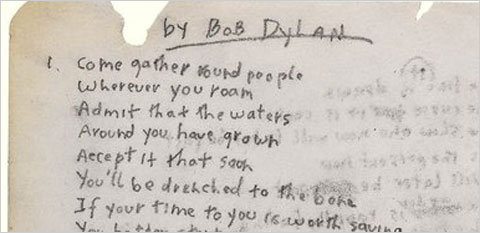

# Applied Data Science @ Columbia





+ Project summary: 
In this project I carried out an exploratory data analysis (EDA) of the corpus of song lyrics and explore the texts using tools from text mining and natural language processing such as sentiment analysis and topic modeling.   

Following [suggestions](http://nicercode.github.io/blog/2013-04-05-projects/) by [RICH FITZJOHN](http://nicercode.github.io/about/#Team) (@richfitz). This folder is orgarnized as follows.

```
proj/
├── lib/
├── data/
├── doc/
├── figs/
└── output/
```

Please see each subfolder for a README file.
